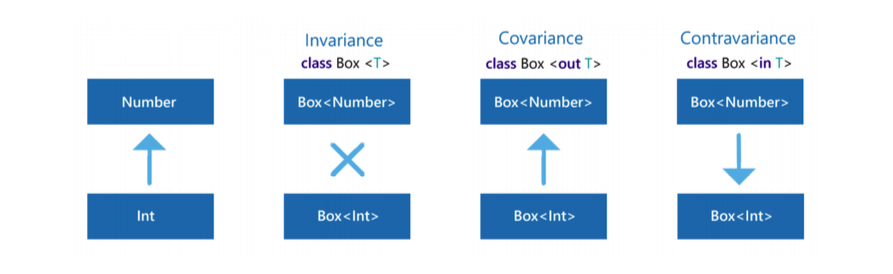

# Reusability

## Do not repeat knowledge
> If you copy-paste in your project, you are most likely doing something wrong.

## [Learn the standard library](https://kotlinlang.org/api/core/kotlin-stdlib/)
> Common algorithms are nearly always already defined by someone
else. Most libraries are just collections of common algorithms. The
most special among them is the stdlib (standard library). It is a
huge collection of utilities, mainly defined as extension functions.
Learning the stdlib functions can be demanding, but it is worth
it. Without it, developers reinvent the wheel time and time again.

>Do not repeat common algorithms. First, it is likely that there is a
stdlib function that you can use instead. This is why it is good to
learn the standard library. If you need a known algorithm that is
not in the stdlib, or if you need a certain algorithm often, feel free
to define it in your project. A good choice is to implement it as an
extension function.!

## Consider variance for generic types

